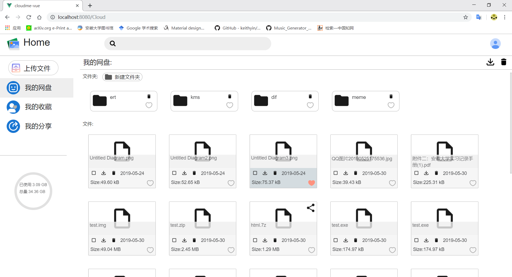

# cloudme-vue
请务必确保npm能够正常下载和安装。

这是一个前端和后端技术都很渣的在校学生，使用vue+php实现的一个加密网盘系统。


## 目前支持：

1. 用户创建

2. 文件上传[加密同时完成]

3. 文件下载[解密同时完成]

4. 文件分享[解密在服务器端进行]

5. 文件收藏

6. 文件夹视图

7. 用户空间配额

##  正在开发的功能：

1. 文件管理（重命名）

2. 超大文件上传、下载

3. 好友功能和好友分享

4. 使用electron构建客户端

5. 增强安全性

## 现有的bug与未来解决方案

1. 在与服务器通信时，会出现偶发性无连接。 -在发送请求前先判断是否与两个服务器建立了有效链接

2. 在上传大文件时，服务器因为需要拼接的文件块太多，致使磁盘I/O过大。 -在块文件达到一定数量时，启动部分拼接的进程

3. 在下载大文件时，因为浏览器策略原因，可能会导致内存溢出，并且无法下载大于2GB的文件（chrome下）。 -使用扩展或本地客户端。或在服务器端解密。

4. 上传多个文件时，会出现偶发性上传错误。 -正在检查问题

5. 在分享大文件时，后端解密速度太慢，会导致前端需要等待的时间过长。-后端分块解密，并向前端反馈

6. 需要html5支持。 -无可替代方案

7. 用户首次登录时，用户数据无法刷新，需要手动刷新才能解决。-正在检查问题

## Project setup
```
npm install
```

### Compiles and hot-reloads for development
```
npm run serve 
```
或者在/src 下 
```
vue serve 
```
默认端口为 127.0.0.1:8080
存储服务器和密钥服务器的IP为：192.168.139.128，请在/src/http/axios.js下修改
两个服务器默认为serverA和serverB，如要修改，请在前端和后端文件中做相应修改
### Compiles and minifies for production
```
npm run build 
```
或者在/src 下 
```
vue build
```

### Customize configuration
See [Configuration Reference](https://cli.vuejs.org/config/).

## special thanks
nodejs

vue 

forge-npm 

vuejs-uploader